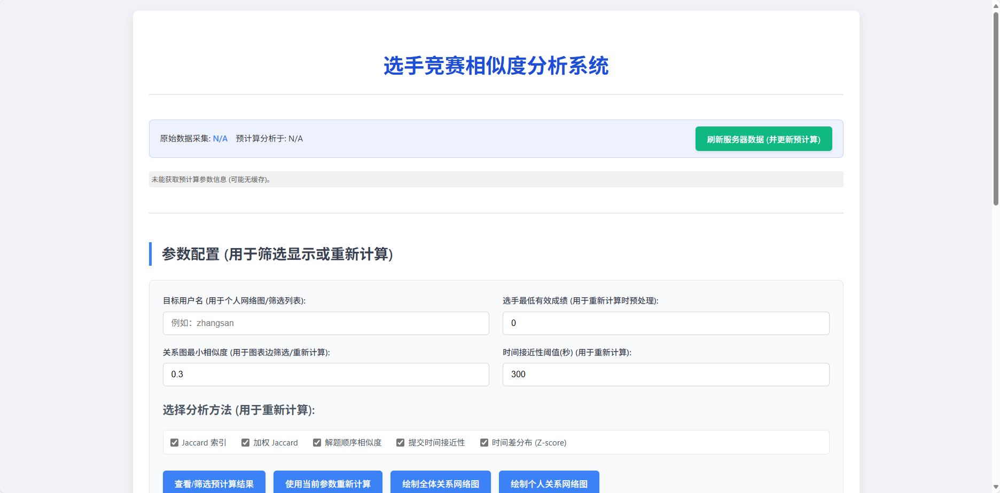
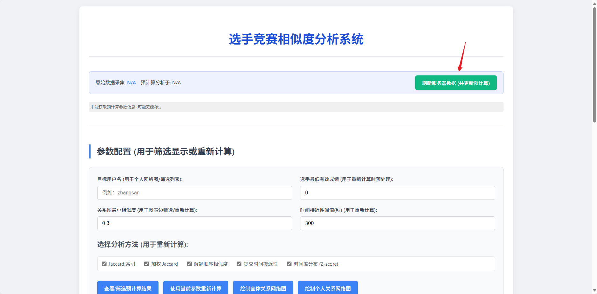
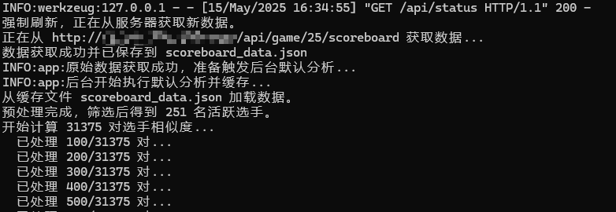
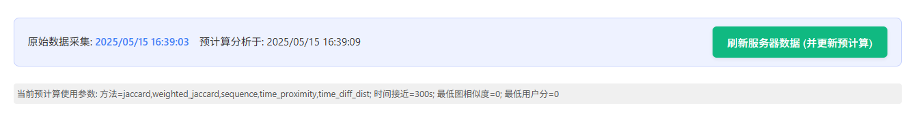
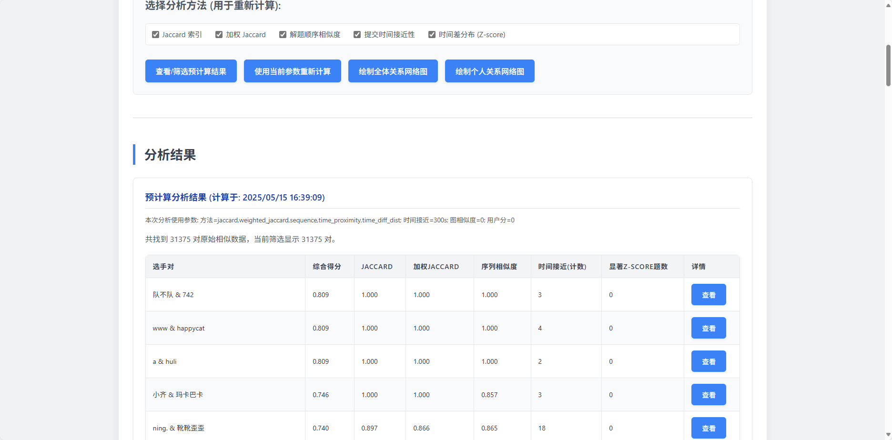
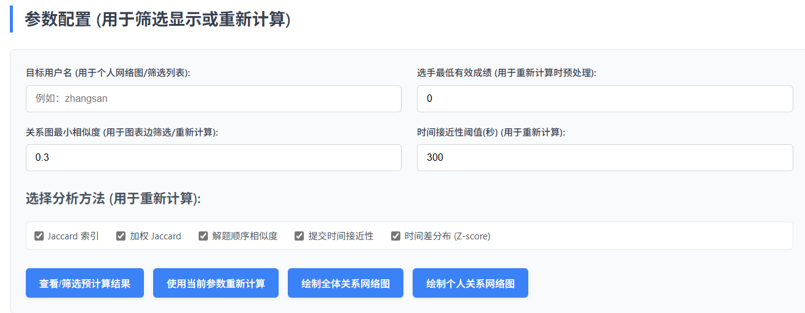
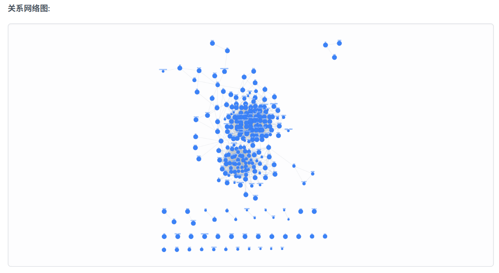
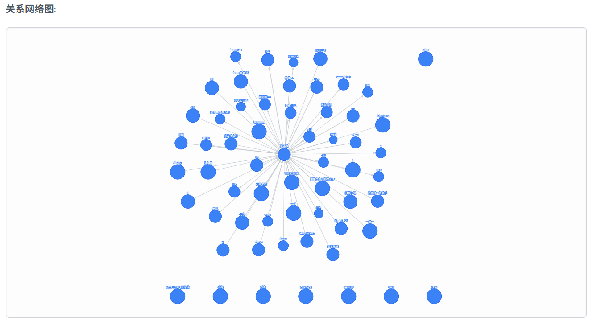
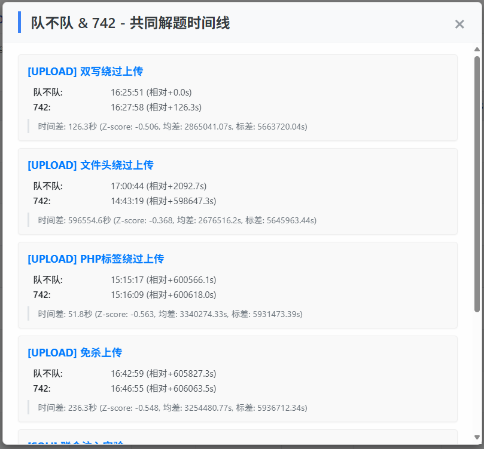
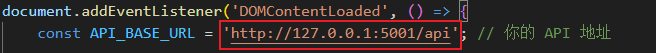

# GZCTF-Analysis: 选手竞赛相似度分析系统


## 项目简介

GZCTF-Analysis 是一个用于分析 CTF 竞赛中选手之间解题行为相似度的系统。通过获取 CTF 平台的计分板数据，系统能从多个维度（如共同解题、解题顺序、提交时间等）计算选手间的相似度，并将结果以表格和关系网络图的形式直观展示，帮助分析竞赛中的潜在合作模式或行为特征。

## 适配于 GZCTF 平台

本项目经过专门设计和测试，**适配于 GZCTF 平台的计分板 API 结构**。只需简单配置 API 地址，即可从 GZCTF 竞赛中抓取数据并进行分析。

## 灵感来源

本项目的设计和实现受到了 [WankkoRee/ISCCAnalysis](https://github.com/WankkoRee/ISCCAnalysis) 项目的启发。

## 功能特性

* 从配置的 CTF 平台 API 抓取最新的计分板数据。
* 缓存原始数据，避免频繁请求 API。
* 支持多种相似度计算方法：
    * Jaccard 索引
    * 加权 Jaccard 索引（考虑题目罕见度）
    * 解题顺序相似度
    * 提交时间接近性（指定时间窗内完成同一题）
    * 提交时间差分布分析（Z-score）
* 提供 Web 界面进行交互式分析。
* 支持按需调整分析参数（最低分数、相似度阈值、时间接近阈值、分析方法）。
* 绘制全体选手关系网络图。
* 绘制指定选手的个人关系网络图。
* 表格展示详细的选手对相似度分数。
* 查看共同解题的时间线详情，包含时间差及 Z-score 分析结果。

## 目录结构
```
GZCTF-Analysis/
├── app.py		# Flask 后端主应用
├── data_fetcher.py		# 数据抓取和缓存模块
├── analysis_engine.py		# 核心分析逻辑和相似度计算模块
├── requirements.txt		# 项目依赖
├── scoreboard_data.json		# 缓存的原始计分板数据 (运行时生成)
├── analysis_results.json		# 缓存的分析结果 (运行时生成)
└── static/
	├── index.html		# 前端主页面
	├── script.js		# 前端 JavaScript 逻辑
	└── style.css		# 前端 CSS 样式
```
## 安装与运行

### 1. 环境准备

确保您已安装 Python 3.x 环境。

### 2. 项目克隆

```bash
git clone https://github.com/cyb0rg-se/GZCTF-Analysis.git
cd GZCTF-Analysis
```
### 3. 依赖安装
```bash
pip3 install -r requirements.txt
```
### 4. 配置
打开 `data_fetcher.py` 文件，修改 `GAME_SERVER_URL` 变量为您实际需要分析的 GZCTF 平台计分板 API 地址。
```
# data_fetcher.py
...
GAME_SERVER_URL = "http://your_gzctf_platform_url/api/game/${比赛ID}/scoreboard"
...
```
请将 `http://your_gzctf_platform_url/api/game/比赛ID/scoreboard` 替换为实际的 API 地址。

您还可以调整 `CACHE_DURATION_SECONDS` 来改变原始数据缓存的有效时间。

### 5. 运行应用
在项目根目录下执行：

```Bash
python3 app.py
```
应用默认运行在 http://127.0.0.1:5001/

您也可以在 `app.py` 中修改 `app.run()` 的参数来更改端口或监听地址。

## 使用说明
1.访问页面: 在浏览器中打开 http://127.0.0.1:5001/



2.数据刷新与预计算: 点击页面顶部的“刷新服务器数据 (并更新预计算)”按钮。系统会从配置的 API 获取最新数据，并在后台执行一次默认参数的分析，结果会自动缓存。状态栏会显示数据采集时间和预计算时间。(一定要配置`data_fetcher.py`的`GAME_SERVER_URL`)







3.查看/筛选预计算结果: 点击“查看/筛选预计算结果”按钮加载最近一次预计算的结果。您可以在“参数配置”区域输入“目标用户名”或调整“关系图最小相似度”来筛选表格和后续绘制的图表显示。***(数据来自某公网部署的GZCTF平台)***



4.参数配置与重新计算: 在“参数配置”区域，您可以：

- 输入“目标用户名”以专注于分析与该用户相关的关系。
- 设置“选手最低有效成绩”，低于此分数的选手将被排除在分析外（仅在重新计算时生效）。
- 设置“关系图最小相似度”阈值，用于筛选关系网络图中的边（仅在绘图或按此参数重新计算时生效）。
- 设置“时间接近性阈值(秒)”，用于时间接近性分析（仅在重新计算时生效）。
- 选择用于重新计算的分析方法。 选择好参数后，点击“使用当前参数重新计算”按钮。系统会使用当前缓存的原始数据和您设定的新参数执行一次分析，结果将显示在页面上（不会覆盖默认预计算缓存）。



5.绘制关系网络图:

- 绘制全体关系网络图: 点击“绘制全体关系网络图”按钮，根据当前表格中显示（受“关系图最小相似度”和“目标用户名”筛选）的数据绘制所有相关选手之间的网络图(如下图)。



- 绘制个人关系网络图: 在“目标用户名”输入框中填写用户名后，点击“绘制个人关系网络图”按钮，绘制该用户及其与其他符合相似度阈值的选手之间的关系图(如下图)。



6.查看详情: 

在分析结果表格中，点击“查看”按钮可以弹出模态框，显示该选手对共同解决的题目列表、各自的提交时间、时间差以及时间差的 Z-score 分析结果。



## 可能的问题

1.点击`刷新服务器数据 (并更新预计算)`按钮无任何反应，你可能需要将`./static/script.js`的`API_BASE_URL`修改为你的IP



***例如：192.168.1.53***

## 数学与统计理论

本项目在分析选手相似度时，使用了以下数学与统计概念：

### 1. Jaccard 索引 (Jaccard Index)

Jaccard 索引用于衡量两个集合的相似度，定义为两个集合交集的大小除以并集的大小。在本项目中，它被用来衡量两位选手**共同解决的题目集合**的相似度。

设集合 $A$ 和 $B$ 分别为选手 A 和选手 B 解出的题目 ID 集合。

$$J(A, B) = \frac{|A \cap B|}{|A \cup B|}$$

Jaccard 索引的值介于 0 和 1 之间，值越高表示两位选手共同解决的题目越多，相似度越高。

### 2. 加权 Jaccard 索引 (Weighted Jaccard Index)

加权 Jaccard 索引是 Jaccard 索引的扩展，它为集合中的每个元素分配一个权重。在 CTF 竞赛中，不同题目的难度或罕见度不同，解出一道罕见的题目更能体现选手的能力或特定行为。本项目使用题目的**罕见度**作为权重，解决人数越少的题目权重越高。

题目 $i$ 的罕见度权重计算方式为：

$$w_i = \frac{\text{总活跃选手人数}}{\text{解决题目 } i \text{ 的人数}}$$

如果没人解决某题，可以给一个默认的高权重。加权 Jaccard 索引的计算公式为：
设集合 $A$ 和 $B$ 为选手 A 和选手 B 解出的题目 ID 集合， $w_i$ 为题目 $i$ 的权重。

$$WJ(A, B, w) = \frac{\sum_{i \in A \cap B} w_i}{\sum_{i \in A \cup B} w_i}$$

加权 Jaccard 索引考虑了共同解决题目的“价值”，解决了更多罕见共同题目的选手对会有更高的加权相似度。

### 3. 解题顺序相似度 (Sequence Similarity)

此指标衡量两位选手**解决共同题目的顺序**有多相似。本项目使用了 Python 的 `difflib.SequenceMatcher.ratio()` 方法，该方法基于 Ratcliff-Obershelp 算法，计算两个序列（即选手的解题 ID 顺序列表）的匹配程度。

该算法会找到两个序列中最长的匹配子序列，并基于匹配块的总长度计算一个相似度比率，范围从 0 到 1。值越高表示两位选手解决共同题目的顺序越接近。

### 4. 提交时间接近性 (Time Proximity)

此指标统计两位选手**在指定时间窗内（例如 300 秒）完成同一道题目**的次数。这是一种简单的启发式方法，如果两位选手多次在极短的时间间隔内解决同一道题目，可能暗示着某种同步行为。

这个指标本身是一个计数，在综合相似度计算中，计数越多贡献的相似度越高（通过一个启发式函数转换为 0 到 1 之间的分数）。

### 5. 提交时间差分布分析 (Z-score Analysis)

此指标进一步分析共同解题的提交时间差。对于一对选手共同解决的某道题目，计算他们提交时间差的绝对值，然后与**所有**解决了这道题的选手对的时间差分布进行比较，计算其 Z-score。

Z-score (标准分数) 的计算公式为：
对于一个数据点 $x$（此处为某对选手在某题上的提交时间差），总体均值 $\mu$ 和总体标准差 $\sigma$：

$$Z = \frac{x - \mu}{\sigma}$$

在这里， $\mu$ 和 $\sigma$ 是针对**该特定题目**，计算所有两两解决了该题的选手对的时间差的均值和标准差。

一个较小（特别是负值较大）的 Z-score 表明这对选手在某题上的提交时间差远小于该题目普遍的提交时间差。例如，Z-score 为 -2 表示他们的时间差比平均时间差小了两个标准差。这可以作为判断异常同步行为的一个强信号。本项目中，Z-score 小于 -1.5 被视为显著的时间接近。

在综合相似度计算中，共同解决的题目中出现显著负 Z-score 的次数越多，对综合相似度的贡献越大（通过一个启发式函数转换为 0 到 1 之间的分数）。


## 鸣谢:
- 本项目受 ISCCAnalysis 启发。
- 数据可视化使用 Cytoscape.js 库。
